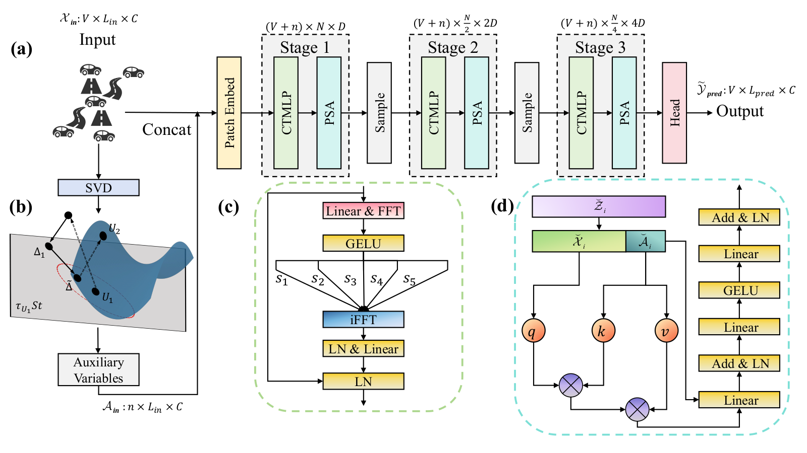

# MFNet: Mobile Long-Term Traffic Flow Forecasting for Low-Altitude Traffic Surveillance


This repository contains the PyTorch implementation of **MFNet** for the manuscript **“Mobile Long-Term Traffic Flow Forecasting for Low-Altitude Traffic Surveillance”** by Li Shen, Yangzhu Wang, Xuyi Fan, Qing Zhang, and Wei Li. The manuscript has been **submitted to IEEE Transactions on Intelligent Transportation Systems (IEEE TITS)**; it is not presented here as an accepted or published paper.

MFNet uses reduced SVD to construct auxiliary variables, Stiefel manifold augmentation during training, cyclic temporal multilayer perceptrons (CTMLP) for periodic temporal patterns, and principal spatial attention (PSA) for scalable interactions among traffic sensors. The model has three encoder stages followed by a direct prediction head.

## Model architecture

<p align="center">
  
</p>

**Figure 1.** Architecture extracted from Fig. 1 of the submitted manuscript. Panel (a) shows the full pipeline; (b) auxiliary variable construction and augmentation; (c) CTMLP; and (d) PSA.

## Requirements

The development environment used Python 3.11.4 and PyTorch 2.1.0 with CUDA 11.8. A GPU is recommended for full experiments; the code also detects a CPU automatically.

```bash
python -m venv .venv
# Activate the environment, then install the CUDA 11.8 PyTorch build if applicable:
python -m pip install torch==2.1.0 --index-url https://download.pytorch.org/whl/cu118
python -m pip install -r requirements.txt
```

For a different CUDA version or CPU installation, select the matching PyTorch 2.1.0 wheel first, then install `requirements.txt`. The Stiefel augmentation requires `geomstats==2.5.0`, which is included in the requirements.

## Raw data and download links

**No dataset, precomputed auxiliary array, checkpoint, or experiment output is included in this repository.** Download the original datasets and place the files at the exact paths below. The names are case-sensitive on Linux.

| Dataset used by `--data` | Download source | Required local file | Expected data read by MFNet |
| --- | --- | --- | --- |
| `Traffic` | [Autoformer benchmark datasets](https://drive.google.com/drive/folders/1ZOYpTUa82_jCcxIdTmyr0LXQfvaM9vIy?usp=sharing), `autoformer/traffic/traffic.csv` | `data/Traffic/Traffic.csv` | 17,544 hourly rows; `date` plus 862 flow series |
| `PEMS03` | [ASTGNN PeMS data](https://github.com/guoshnBJTU/ASTGNN/tree/main/data/PEMS03), `PEMS03.npz` | `data/PEMS/PEMS03.npz` | NPZ `data` array, first feature channel, 358 sensors |
| `PEMS04` | [ASTGNN PeMS data](https://github.com/guoshnBJTU/ASTGNN/tree/main/data/PEMS04), `PEMS04.npz` | `data/PEMS/PEMS04.npz` | NPZ `data` array, first feature channel, 307 sensors |
| `PEMS07` | [ASTGNN PeMS data](https://github.com/guoshnBJTU/ASTGNN/tree/main/data/PEMS07), `PEMS07.npz` | `data/PEMS/PEMS07.npz` | NPZ `data` array, first feature channel, 883 sensors |
| `PEMS08` | [ASTGNN PeMS data](https://github.com/guoshnBJTU/ASTGNN/tree/main/data/PEMS08), `PEMS08.npz` | `data/PEMS/PEMS08.npz` | NPZ `data` array, first feature channel, 170 sensors |
| `CA-D5` | [LargeST 2017 California data](https://www.kaggle.com/datasets/liuxu77/largest), `ca_his_raw_2017.h5` | `data/CA-D5/ca_his_raw_2017.h5`, then `data/CA-D5/CA-D5.npy` | 16,992 five-minute rows; 211 selected sensors |

The Traffic download uses the standard Autoformer benchmark folder. Rename `traffic.csv` to `Traffic.csv`; keep its `date` column and all 862 sensor columns. The PeMS downloads are the original `.npz` files in the four ASTGNN dataset folders, not the `.csv` adjacency files or ASTGNN's windowed `.npz` outputs. MFNet reads `archive['data'][:, :, 0]`, so retain that raw NPZ structure. For LargeST, download the **2017** raw HDF5 file from the source dataset; its license and access terms remain with that provider.

After downloading, the relevant tree is:

```text
data/
├── Traffic/Traffic.csv
├── PEMS/PEMS03.npz
├── PEMS/PEMS04.npz
├── PEMS/PEMS07.npz
├── PEMS/PEMS08.npz
└── CA-D5/ca_his_raw_2017.h5
```

Generate the CA-D5 slice from the raw LargeST HDF5 file:

```bash
python Get_CA_D5.py
```

This reads `t/block0_values`, keeps the first 16,992 timestamps and sensor columns 2,832–3,042 (Python slice `2832:3043`), forward and backward fills missing entries, and writes `data/CA-D5/CA-D5.npy` with shape `(16992, 211)`. Inspect the HDF5 key if the upstream provider changes its file structure.

## Data processing performed by the loader

The code in `data/data_loader.py` performs the following steps when an experiment starts:

1. Read Traffic as a CSV without the `date` column, PeMS from the first channel of the `data` array, or CA-D5 from the generated NumPy array. Missing values are forward filled and then backward filled; PeMS and CA-D5 also fill any remaining missing values with zero.
2. Split rows chronologically into **70% training, 10% validation, 20% test**. Validation and test windows include `input_len` preceding rows as context, but their prediction targets belong to their own split. Fit `StandardScaler` only on the training rows, then transform the full series. Long-term metrics are computed in this normalized space.
3. Construct sliding windows with stride 1 and total length `input_len + max(pred_len)`. For every input window, compute a reduced SVD and retain `floor(0.1 × number_of_sensors)` left singular vectors by default (`--U_num 0.1`). PeMS and CA-D5 subsample the input at stride 12 for this SVD; Traffic uses every hourly input point.
4. Save generated training, validation, and test auxiliary arrays as `train_U.npy`, `vali_U.npy`, and `test_U.npy` in `Preprocess/<dataset>_<input_len>_<max_pred_len>_<U_num>/`. This first pass can take substantial time and disk space. Future runs reuse the cache. Delete the corresponding cache directory if the raw data or preprocessing settings change.
5. During training only, apply Stiefel augmentation to an auxiliary array with probability `--aug_p`; the perturbation extent is controlled by `--aug_e`.

These generated arrays, raw datasets, and all checkpoint/result files are ignored by Git.

## Training and evaluation

Run commands from the repository root. `scripts/Main.sh` contains the six full long-term configurations from the experiment setup. For example, to train and evaluate Traffic:

```bash
python -u main.py --data Traffic --input_len 168 --pred_len 96,192,336,720 \
  --encoder_layer 3 --patch_size 6 --d_model 128 --U_num 0.1 --S_num 7 \
  --learning_rate 0.0001 --dropout 0.1 --batch_size 4 --train_epochs 10 \
  --itr 5 --train --patience 3 --aug_p 0.5 --aug_e 0.5 --decay 0.5
```

For PeMS and CA-D5, use an input length of 2016 and patch size 24; see `scripts/Main.sh` for complete commands. The prediction horizons are 96, 192, 336, and 720 for the manuscript's long-term setting. The script trains the longest horizon once per repetition and evaluates shorter horizons by slicing its predictions. `--itr 5` trains five runs and the current evaluation code averages their saved predictions before reporting MAE, RMSE, and MAPE in `result.csv`. `--save_loss` retains checkpoints and prediction arrays; without it, the program removes them after computing metrics. Omit `--train` only when matching checkpoints already exist.

`main.py` sets the data path and sensor count from `--data`; passing `--root_path`, `--data_path`, or `--enc_in` does not override the built-in entries for these six names. Update `data_parser` in `main.py` if you use differently named files. Other command-line options, including `--reproducible`, are documented by `python main.py --help`.

The release copy includes three correctness and compatibility fixes: checkpoint selection uses the validation split, scalar loss calls standard `loss.backward()`, and the Stiefel exponential uses the same canonical block formula through SciPy to avoid a read-only array error in the original geomstats call. These preserve the intended model while making the provided training path executable. Results from this release should be regenerated rather than assumed identical to earlier local runs.

## Repository layout

```text
MFNet/               # Model, CTMLP, PSA, and embedding
data/data_loader.py   # Dataset splits, normalization, SVD auxiliary cache
exp/                  # Training, validation, and evaluation
utils/                # Metrics, RevIN, Stiefel augmentation, training helpers
scripts/Main.sh       # Six full long-term configurations
Get_CA_D5.py          # Extract the CA-D5 slice from LargeST 2017
main.py               # Command-line entry point
img/                  # Architecture figure from the manuscript
```

## Citation and contact

The manuscript is under review at IEEE TITS. Please cite the paper once its final bibliographic record is available. For questions about the code or data setup, open a GitHub issue or contact Li Shen at `shenli@buaa.edu.cn`.
